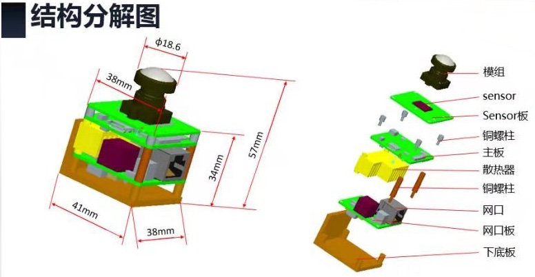
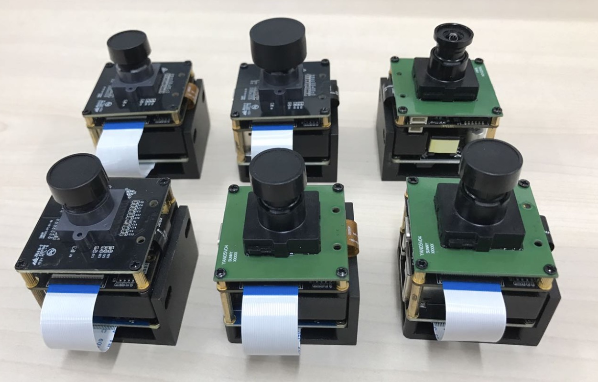
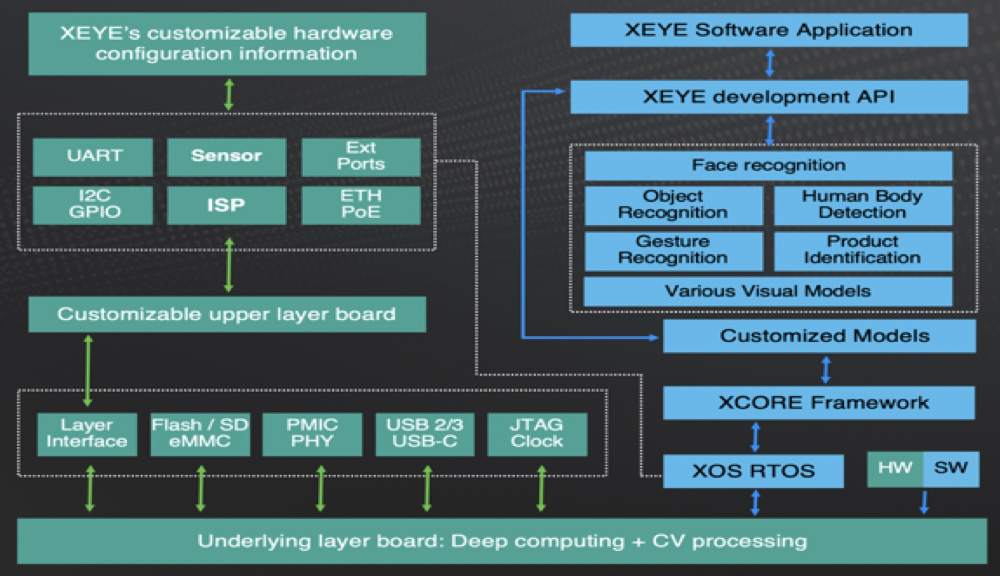

# Hydra XEYE

Baidu Research Institute Hydra XEYE prototype with patented software & hardware architecture design

## Overview

Hardware
- BRI PCB w/ AI Silicon Integration Design
- Intel® Movidius™ and 3rd party OEM/ODM partners

Software
- BRI XOS & XCORE Software
- BRI Neural Network Models
- Intel® Movidius™ Myriad Development Kit

Cloud
- Baidu Cloud Service

## Prototype
The prototype structure can be illustrated into multiple layers of components:

 

The prototype has customized configuration to meet different application requirement:

| Index | Prototype | Sensor | Interface | Lens |
| :---: | :---: | :---: | :---: |:---: |
| 1 | WiFi Camera | AR0521 black sensor board | DC12V/Battery | wide-angle |
| 2 | POE Camera | AR0521 black sensor board | Eth POE | wide-angle |
| 3 | WiFi Camera | 05A10 green sensor board | DC12V/Battery | regular |
| 4 | POE Camera | 05A10 green sensor board | Eth POE | regular |
| 5 | WiFI Camera | AR0521 black sensor board | DC12V/Battery | wide-angle |
| 6 | POE Camera | AR0521 black sensor board | Eth POE | wide-angle |
| 7 | Integrated Camera | AR0521/05A10 green/black sensor board | Eth/WiFi/USB/Battery/DC | wide-angle/regular |

## Architecture
XEYE software consist of XOS and XCORE running on the above hardware prototypes

XOS - operating system on top of Hydra XEYE
- Basic MDK and tools
- Inference Optimization
- Real-time updates	

XCORE - applications basing on XOS for different scenarios use cases
- Platform: Core, module, config & lib
- Applications:
	* Human body
	* Tracking
	* Crowd
	* ReID
	* Face and so on

## Contact
Please contact hydra@baidu.com for technical discussion

