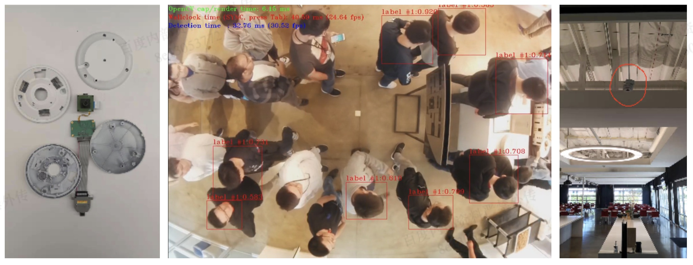

# Crowd App

## Supported Platform
This app works on Hydra Xeye platform

## Overview
People detection and counting



## User interaction
Here is the code base structure
```
.
├── build
├── config
├── leon
├── leon_rt
├── Makefile
├── models
├── README.md
├── scripts
└── shared
```
As well as the execution
```
make start_server
make run -j8
```
